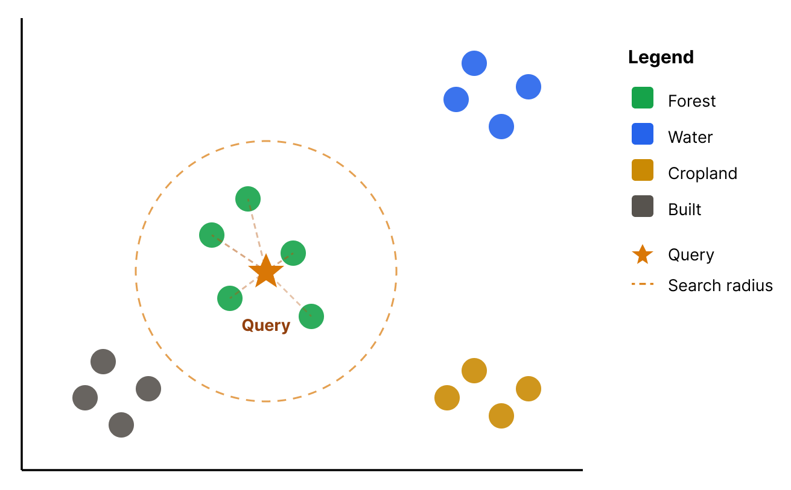

# Glossary

---

### Pretraining
Learning general-purpose geospatial representations from large unlabeled Earth observation datasets. Typically done by researchers who produce and publish embeddings and models to generate them from different modalities.

---

### Geospatial Embedding
A numerical vector produced by a trained model that encodes the meaningful properties of geospatial data into a continuous vector space.

**Example Types of Embeddings:**

- **Pixel Time Series Embeddings** — An embedding derived from the temporal sequence of satellite observations at a single pixel location rather than from a spatial image chip *(Example: Presto)*.

- **Spatiotemporal Window Embeddings** — An embedding produced by processing a stack of image chips at the same location across multiple timestamps, capturing both spatial and temporal patterns *(Example: OlmoEarth)*.

- **Multimodal Spatiotemporal Image** — *(TBD)*

- **Multimodal Multitemporal Location + Imagery** — *(TBD)*

---

### Patch

**In remote sensing:**
Analogous to an image chip, window, or tile — a spatial subset or window read from a larger image.

**In embeddings:**
The spatial window used to compute tokens in an embedding model. For example, Clay uses an 8×8 patch size.

---

### Embedding Size
The number of dimensions in the embedding vector. This is also referred to as the *length* of the embedding vector. For example, Google AlphaEarth has 64 dimensions.

<!-- embedding_size.svg -->

---

### Scene Embedding
A single vector representation that captures the overall characteristics of an entire image tile or geographic scene, as opposed to patch-level embeddings that describe individual pieces of it. Typically derived from the CLS token or by pooling all patch embeddings together.

---

### CLS Token
A summary token whose output vector represents the entire image as a single embedding, rather than any individual patch.

---

### Embedding Quantization
The process of reducing the numerical precision of embedding vectors by representing their values with lower-precision numbers or discrete codes, reducing memory and speeding up similarity search.

---

### Latent Space
The vector space in which embeddings exist. Each embedding occupies a point in this space, and the structure of the space encodes semantic relationships — similar places are positioned nearby, dissimilar places are far apart.

---

### Features
Inputs to a model. This is context-dependent and could refer to raw pixel values, engineered features, or embeddings if they are used as input into a downstream model.

---

### Fine-tuning
Updating some or all of a foundation model's pre-trained weights on a smaller, task-specific dataset to adapt its learned representations to a particular downstream application.

<!-- fine_tuning.svg -->

---

### Linear Probing
A technique used to evaluate the quality of features (embeddings) by training a simple, shallow linear classifier (a "probe") on top of embeddings.

---

### Zero-shot
Using pretrained embeddings directly for a task without any additional training or fine-tuning. Performance is usually lower than fine-tuned, but it requires zero labeled data.

---

### Few-shot
Fine-tuning or prompting a model with only a handful of labeled examples (say, 5–50) per class.

---

### Similarity Search
A technique used to find data points that are mathematically "close" to a given query within the vector space.

**Example Search Methods:**
- Cosine similarity
- Dot product
- Euclidean distance

---

### Multimodal

**In remote sensing:**
Often referred to as *multi-sensor* — when multiple different sensors are used as inputs. This doesn't necessarily require multiple modalities. For example, it could refer to using Sentinel-2 + Landsat together (both optical), but could also refer to using Sentinel-2 (optical) + Sentinel-1 (SAR) together.

**In embeddings:**
When multiple different input modalities are used. This could refer to using Sentinel-2 and Sentinel-1 together, but could also include data such as text, climate, or elevation data. Generally would *not* include using multiple sensors of the same modality (e.g., Sentinel-2 + Landsat, both optical).

---

### PCA
**Principal Component Analysis.** A linear method that projects high-dimensional embeddings into a lower-dimensional space (usually 2D or 3D) while preserving as much global variance as possible for visualization.

---

### t-SNE
**t-distributed Stochastic Neighbor Embedding.** A nonlinear method that visualizes embeddings by mapping them to 2D or 3D while preserving local similarity, so points that are close in embedding space appear close in the plot.

---

### Benchmark
A community-trusted, standardized dataset and evaluation protocol used to measure how well a geospatial foundation model's embeddings perform across a set of downstream tasks.

---

### GeoParquet
A format for storing geospatial data in Parquet tables with geometry and spatial metadata, making it efficient for large-scale geospatial analytics and cloud processing.

---

### Zarr
A format for storing large multidimensional arrays in chunked form. Designed for high-performance, parallel computing and cloud-native storage (e.g., S3, Google Cloud Storage) by breaking arrays into small, independently readable binary chunks. Typically, embeddings are published in Zarr format.

---

### Cloud Optimized GeoTIFF (COG)
A regular GeoTIFF file, aimed at being hosted on a HTTP file server, with an internal organization that enables more efficient workflows on the cloud.

---
